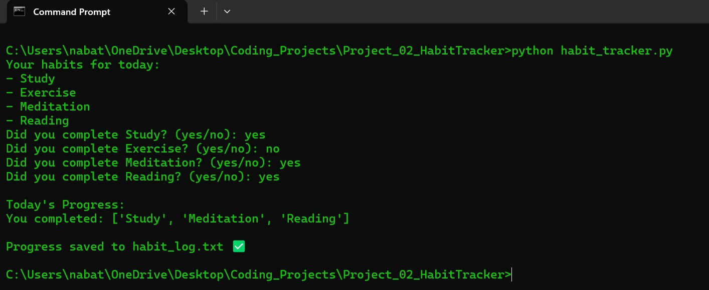
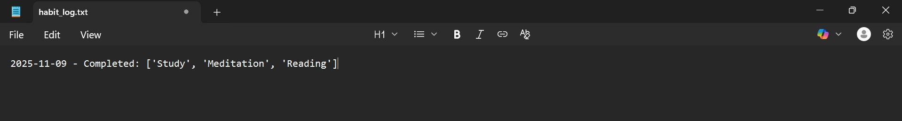

# Habit Tracker

A simple Python program to track daily habits and log completed tasks each day.
This helps build consistency, discipline, and long-term self-improvement.

## How It Works

- The program lists daily habits.
- You answer **yes/no** for each.
- Your progress is **saved automatically** in `habit_log.txt`.

## Example Run

## Log Format Example

## Skills Learned

- Lists and loops
- Conditional logic
- File handling (`open`, write, append)
- Use of `datetime.date`

## To Run
python habit_tracker.py
